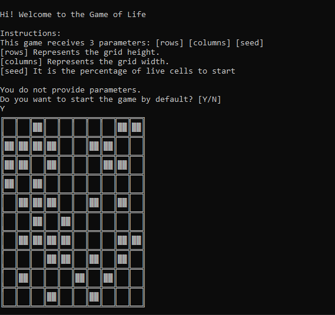

# GameofLife_Conway
The Game of Life, also known simply as Life, is a cellular automaton devised by the British mathematician John Horton Conway in 1970. The “game” is a zero-player game, meaning that its evolution is determined by its initial state, requiring no further input. One interacts with the Game of Life by creating an initial configuration and observing how it evolves.

## Installation & Usage

To get started you'll first want to install the required Ruby gems and clone the repository:

```console
git clone https://github.com/dantechnologymx/GameofLife_Conway.git
```

## Example


